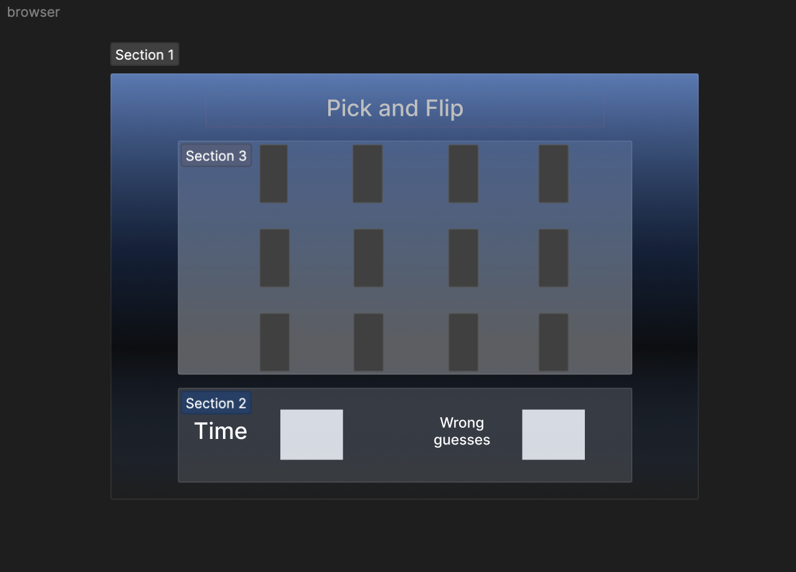

Game title: pick and flip

A game where you have 16 cards and you have to memorize each set of cards. after a set amount of time, the cards will be flipped over and you will have to guess where each identical cards are. if you manage to get all identical cards in time, you win, but, if you guess too many times and didnt get the identical cards, you lose.

wireframe UI:

 
 
 

Technologies used:
HTML
CSS
JavaScript

getting started :
[Click to play Pick And Flip!]
https://haris1221.github.io/pick-and-flip/

User stories:
- i want to have a single player to play the game.

- the game will start when i click on the start button.

- timer will start once the user clicks on start.

- i will have a choice of 12 cards to choose from.

- if i click on a card, it will be flipped over and wait for another card to be clicked to compare.

- if i choose 2 identical cards, they will stay flipped forwards.

- if the player chooses 2 non identical cards, they will flip back to their original spot.

- each card should be able to update images when the game starts

- out of the 16 cards each 2 will have similar images 

- as the player, i will have a set amount of time to choose all identical cards 

- as the player, if i choose the wrong idnetical cards 10 times, the game will be over 

- as the player, if i choose all the correct identical cards, the game will end and assign me the winner

- i will also have the choice to play the game again.

pseudocode and Bonuses:

1- use constants to store the variables that are unchangegable 
    - const wrongGuesses to be set to the amount of times the player can guess wrong which can be any number between 5-10.
    - const arrays to hold the array or cards in the game and in order to use a for loop to loop through each card individually.
    - an object to hold the key to the card and the picture value of that card to be able to identify the identical cards during the game.

2- store the app state variables that are going to be used in the game.
    - let turns equals to how many cards have been clicked all together. keeping track of this will make it easier to set the player to only have a certain amount of turns which will be only 2 times, once for each card clicked and then stop and check if the 2 cards clicked are identical.
    - let guesses equals to the amount of times the player has clicked on and even number of cards.
    - let time equals to the amount of time the player has to complete the game which can be set to be a 2 min timer.
    - let flippedCard equals to false to identify which cards have been flipped, if the card is set to false, that means this is the first time the player has clicked on this card.

3- write functions for the game 
    - function to stop player from choosing more than 2 cards
    - function if 2 cards chosen are identical or not, if the card is set to false, set it to true and compare the values of both cards clicked, if they are the same then both cards are identical.
    - fucntion to see if the player has chosen all identical cards, if all cards are set to true, that means all cards have been clicked, if all cards that are true have been tested to be identical, then the player wins.
    - a render function to handle all player intercations with the game. eg. if the player clicks on start, if the player clicks on a card, etc.

4- add event listeners 
    - when a card is clicked, flip it over to reveal its value, if the values of the flipped cards are equal, then identical.
    - when mouse is hovered over a card, change cursor to make it easier for the user to understand what is clickable and what is not to avoid confusion. if any.

bonus: 
    - add animations for the cards when they are flipped over.
    - add a sound when two identical cards are flipped.
    
