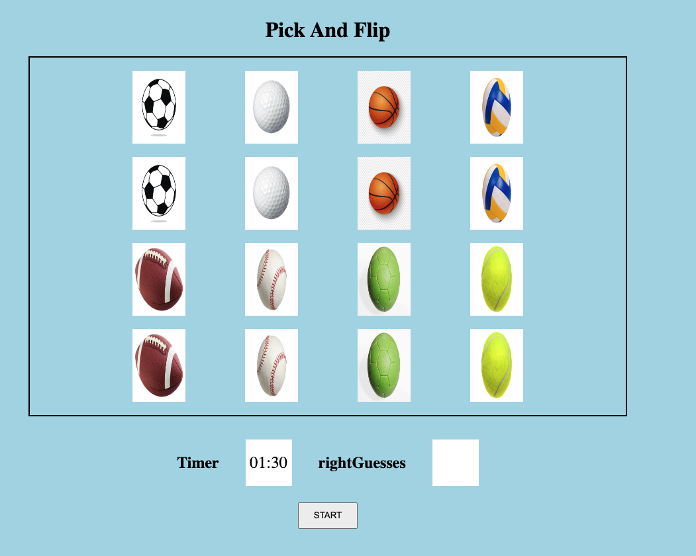

Game title: pick and flip

A game where you have 12 cards and you have to memorize each set of cards. after a set amount of time, the cards will be flipped over and you will have to guess where each identical cards are. if you manage to get all identical cards in time, you win, but, if you guess too many times and didnt get the identical cards, you lose.

wireframe UI:

 

Technologies used:
HTML
CSS
JavaScript

User stories:

- i want to have a single player to play the game.

- i will have a choice of 12 cards to choose from.

- if i choose 2 identical cards, they will stay flipped forwards.

- if the player chooses 2 non identical cards, they will flip back to their original spot.

- each card should be able to update images when the game starts

- out of the 12 cards each 2 will have similar images 

- as the player, i will have a set amount of time to choose all identical cards 

- as the player, if i choose the wrong idnetical cards 10 times, the game will be over 

- as the player, if i choose all the correct identical cards, the game will end and assign me the winner

- i will also have the choice to play the game again.

pseudocode and Bonuses:

1- use constants to store the variables that are unchangegable 
    - const wrongGuesses

2- store the app state variables that are going to be used in the game.
    - let turns 
    - let guesses
    - let picks
3- write functions for the game 
    - function to stop player from choosing more than 2 cards
    - function if 2 cards chosen are identical or not 
    - a render function 

4- add event listeners 
    - when a card is clicked, flip it over 
    - when mouse is hovered over a card, change cursor

bonus: 
    - add animations for the cards when they are flipped over.
    - add a sound when two identical cards are flipped.
    
